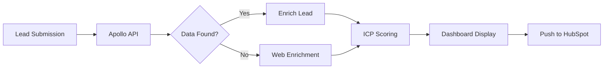

# Apollo.io Integration & ICP Scoring

Enterprise-grade lead enrichment and qualification using Apollo.io API with your ICP framework.

## Overview

The dashboard automatically enriches leads with Apollo.io data and scores them (0-100) based on your Ideal Customer Profile criteria.

## Apollo Enrichment

### What Data is Collected

For every lead, Apollo provides:

- **Revenue range** (e.g., "$10M - $50M", "$1B+")
- **Employee count** (accurate numbers from LinkedIn)
- **Industry**
- **Founded year**
- **Headquarters** (city, country)
- **Company LinkedIn URL**
- **Tech stack** (technologies used)
- **Phone number**
- **Company description**

### How It Works

```
Webflow Lead → Apollo API → Enriched Data → ICP Scoring → Dashboard
```

1. **Lead submits form** with tracking code
2. **Apollo API called** with company domain
3. **Data enriched** (revenue, employees, industry, etc.)
4. **ICP score calculated** (0-100 points)
5. **Displayed in dashboard** with priority badge

### Manual Re-enrichment

Each lead card has an enrichment button:
- **"✨ Enrich with Apollo"** (for non-enriched leads)
- **"🔄 Re-enrich with Apollo"** (to update existing data)

## LinkedIn Profile Finder (People Match)

In addition to company enrichment, Apollo is used to find each prospect's personal LinkedIn profile.

### How It Works

1. Lead card shows **"in?"** button next to the email address
2. Clicking it calls Apollo's `/v1/people/match` endpoint
3. **Strategy 1**: Match by email address (highest accuracy)
4. **Strategy 2**: Fallback to first name + last name + organization/domain
5. If found, the **"in?"** button turns into a clickable **"in"** link to the profile
6. If not found, manual search links (Google, LinkedIn) are shown with a paste input

### Hit Rate

Testing across real prospects shows ~83% success rate using email-first matching.

### Data Returned

- LinkedIn profile URL
- Full name, title, headline
- Organization name
- City, country

### Integration with HubSpot

When a lead is pushed to HubSpot, the LinkedIn profile URL is stored in the built-in `linkedin` contact property. The URL field is also available in the push modal for manual entry or correction.

## ICP Scoring Framework (0-100 Points)

Your leads are scored using this exact framework:

### Company Match (50 points)
- **LinkedIn domain match** (15 pts): Domain matches LinkedIn company
- **Employee count** (15-20 pts):
  - ≥200 employees = 20 pts
  - ≥50 employees = 15 pts (ICP minimum)
  - <50 employees = 0 pts
- **Independent brand** (10 pts): Not a holding company/agency
- **Industry fit** (10 pts): Fashion, beauty, electronics, home goods, lifestyle

### Catalog/Velocity (20 points)
- **SKU count ≥50** (10 pts)
- **Marketing tools** (5 pts): Klaviyo, Mailchimp, Attentive, Yotpo
- **E-commerce platform** (5 pts): Shopify, Magento, BigCommerce, VTEX

### Persona Density (20 points)
- **ICP-aligned title** (5 pts): E-commerce, DTC, Digital, Merchandising, Product
- **Senior role** (5 pts): Head, VP, Director, Chief
- **Relevant persona** (5 pts): Contact matches ICP criteria

### Timing/Context (10 points)
- **Replatforming signals** (5 pts): Migration, redesign, new platform
- **Multi-channel** (5 pts): Amazon, wholesale, DTC, omnichannel

## Priority Levels

| Score | Priority | Action |
|-------|----------|--------|
| 80-100 | **VERY HIGH** 🔥 | Immediate outreach, senior rep |
| 60-79 | **HIGH** ✅ | Standard outreach sequence |
| 40-59 | **MEDIUM** ⚠️ | Nurture sequence |
| 20-39 | **LOW** 🔻 | Long-term nurture |
| <20 | **DISQUALIFIED** ❌ | Reject or park |

## Setup

### 1. Get Apollo API Key

1. Go to [apollo.io](https://apollo.io) → Settings → API
2. Create **Enrichment API** key (not Search API)
3. Copy your API key

### 2. Add to Environment

```bash
# .env
APOLLO_API_KEY=your_apollo_api_key_here
```

### 3. Test the Integration

```bash
python3 pipeline/apollo_enrichment.py shopify.com
```

Expected output:
```
✅ Company: Shopify
💰 Revenue: $1B+
👥 Employees: 8,100
🏢 Industry: information technology & services
```

### 4. Restart Dashboard

```bash
python3 run.py
```

## Dashboard Display

### For Enriched Leads

Prominent **Apollo Enrichment Data** box shows:
- 💰 Revenue
- 👥 Employees
- 🏢 Industry
- 🔗 LinkedIn URL

Plus expandable "Apollo Company Details" section with:
- Founded year
- Headquarters
- Phone number
- Tech stack
- Full description

### ICP Analysis Section

Shows:
- **Score**: 0-100 points
- **Priority badge**: Color-coded
- **Reasons**: Why this score was given
- **Missing data**: What could improve the score

## Data Flow



## HubSpot Integration

When pushing a lead to HubSpot, all Apollo data is stored in custom properties:
- Revenue range
- Employee count
- Industry
- LinkedIn URL
- Founded year
- Headquarters

Plus LinkedIn post attribution (source, creator, date, track).

## Troubleshooting

### Apollo not enriching

1. Check API key: `cat .env | grep APOLLO`
2. Test API: `python3 pipeline/apollo_enrichment.py test.com`
3. Check credits at apollo.io
4. Verify error logs in terminal

### Low ICP scores

- **Missing data**: Add more fields to improve scoring
- **Re-enrich**: Click the enrichment button to update
- **Manual override**: Check ICP reasons and adjust criteria in `pipeline/icp_checker.py`

### Enrichment button not working

1. Check browser console for JavaScript errors
2. Verify dashboard is running: `lsof -ti:3000`
3. Check API endpoint: `curl http://localhost:3000/api/leads/{id}/enrich -X POST`

## Best Practices

1. **Re-enrich quarterly**: Company data changes (growth, funding)
2. **Monitor credits**: Apollo charges per enrichment
3. **Use for all leads**: Even organic traffic gets scored
4. **Review ICP scores**: Adjust thresholds based on conversion data
5. **Combine with manual research**: Use quick research links for edge cases

## API Limits

Apollo.io has rate limits:
- Check your plan at apollo.io/settings
- Dashboard respects rate limits automatically
- Manual enrichment button uses 1 credit per call
- Failed enrichments (404) don't consume credits

## Related Documentation

- [SETUP.md](SETUP.md) - Initial setup and installation
- [HUBSPOT.md](HUBSPOT.md) - HubSpot CRM integration
- [ARCHITECTURE.md](ARCHITECTURE.md) - System design
